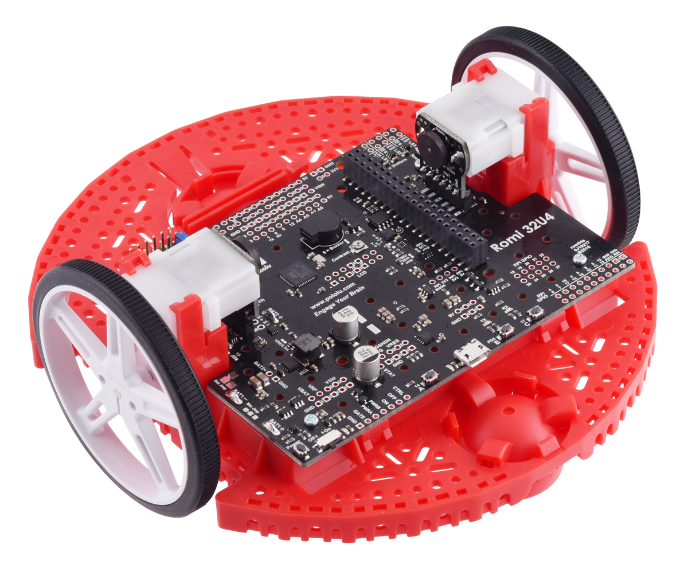
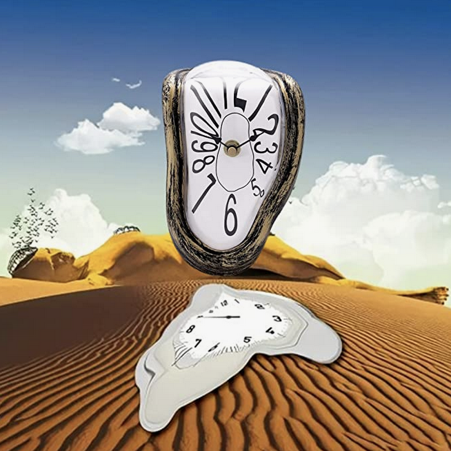
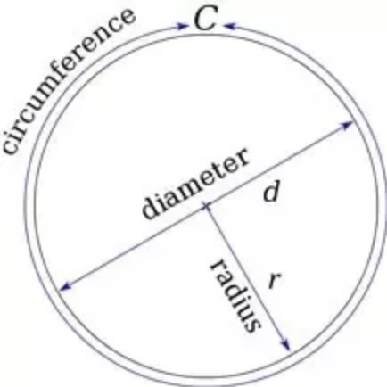
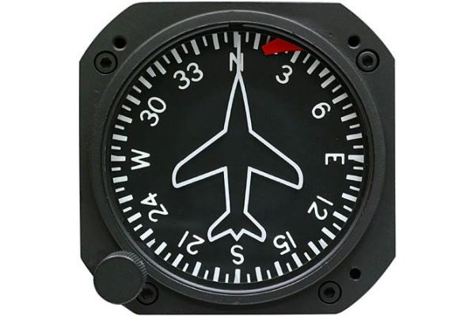

# Robots


---

> We spin motors AND READ SENSORS
```
gyro.getAngle()
```

---

# Open loop control

* Calculate the output variables of the system (e.g. motor speed) based on simple formulas, and apply them.

* The benefit of open loop is that it's *really* simple - we've already implemented multiple open-loop control systems.

* The drawback is that it can't achieve a predictable result - it won't account for external disturbances like friction, battery loss, bent parts, etc.

---

# Closed loop control

* Define a "setpoint" (e.g. target position/velocity) and use *feedback* from sensors to measure error. Calculate outputs based on error and apply them.

* The benefit of closed loop is that it can ensure a target state (e.g. move forward exactly 12 inches) even  if disturbed.

* The drawback is that it's much more complex and requires tuning.

---

# 2022 competition bot

[.column]

* Clock
* Wheel encoders (13)
* Limit switch
    * Intake chute
    * Extension arm

[.column]

* Controller
    * 4 joystick axes
    * 2 joystick buttons
    * 2 trigger axes
    * 4 letter buttons
    * 2 bumper buttons
    * Back/start
    * POV (aka D-Pad)

---

# Romi



* Clock
* Left encoder
* Right encoder
* Gyro

---

# Clock



Measures time in seconds since the robot was turned on.

Useful for timed loops (e.g. "do this for five seconds")

Very important in autonomous mode.

---

# Encoders



Measures distance wheel has travelled in "pulses".

Useful for moving to a specific distance, or spinning at a specific rate.

* 1,440 pulses per revolution
* 2.75591 in. wheel diameter
* (π x d) / ppr inches per pulse

---

# Gyro



Measures heading of robot in degrees.

_Must be calibrated each time the robot is turned on._

Useful for turning to a specific heading, or rotating at a specific rate.

---

# Java


---

# API (1/2)

```java
// time in seconds since the robot started
double time = Timer.getFPGATimestamp();

// distance travelled by left and right wheels
// (note that they are different!)
double leftInches = parts.leftEncoder.getDistance();
double rightInches = parts.rightEncoder.getDistance();

// current heading of the robot in degrees (-180 to 180)
double heading = parts.getAngle();
```

---

# API (2/2)

```java
// buttons
boolean b = controller.get{xxx}Button();
boolean b = controller.get{xxx}ButtonPressed();
boolean b = controller.get{xxx}Bumper();
boolean b = controller.get{xxx}BumperPressed();


// axes
double d = controller.get{Left/Right}{X/Y}();
double d = controller.get{Left/Right}TriggerAxis();
```

---

# If/Else Ladder

Use this when you want to exactly one of a couple of different options.

```java
if (x < 10) {
    // do something
} else if (x < 20 {
    // do something
} else {
    // do something
}
```

---

# Smart Dashboard

```java
public MyRobot {

    double leftSpeed;
    double rightSpeed;
    double maxSpeed;

    public void robotPeriodic() {
        // puts data on to the dashboard so you can see it while the robot is running
        SmartDashboard.putData("MyRobot", (builder) -> {
            builder.addDoubleProperty("Left Speed", () -> leftSpeed, null);
            builder.addDoubleProperty("Right Speed", () -> rightSpeed, null);
            builder.addDoubleProperty("Max Speed", () -> maxSpeed, (v) -> maxSpeed = v);
        });
    }
    
    public void teleopPeriodic() {
        // calculate left/right
        // spin the motors
    }
}
```

---

# Coding problems


---

# Timed activity

* When the B button is pressed, drive forward for exactly 3 seconds
* Variations
    * Allow setting max speed from dashboard
    * Allow setting time interval from dashboard

---

# Position control

* When the B button is pressed, drive forward exactly 12 inches
* Variations
    * Allow setting parameters from dashboard
    * Smooth in/out velocity

---

# Heading control

* When the B button is pressed, turn right by 90 degrees
* Variations
    * Allow setting parameters from dashboard
    * Smooth in/out velocity
    * A button turns left by 90 degrees

---

# Autonomous bot

* When autonomous mode is engaged
    * Drive forward 12 inces
    * Turn left 180 degrees
    * Drive forward 12 inches

---

# PID Controllers

* Experiment with `PIDController`
* Variations
    * Try out different tuning processes

---

# Pad drive

* Y button moves forward 12 inches
* A button moves backward 12 inches
* X button turns left 90 degrees
* B button turns right 90 degrees

